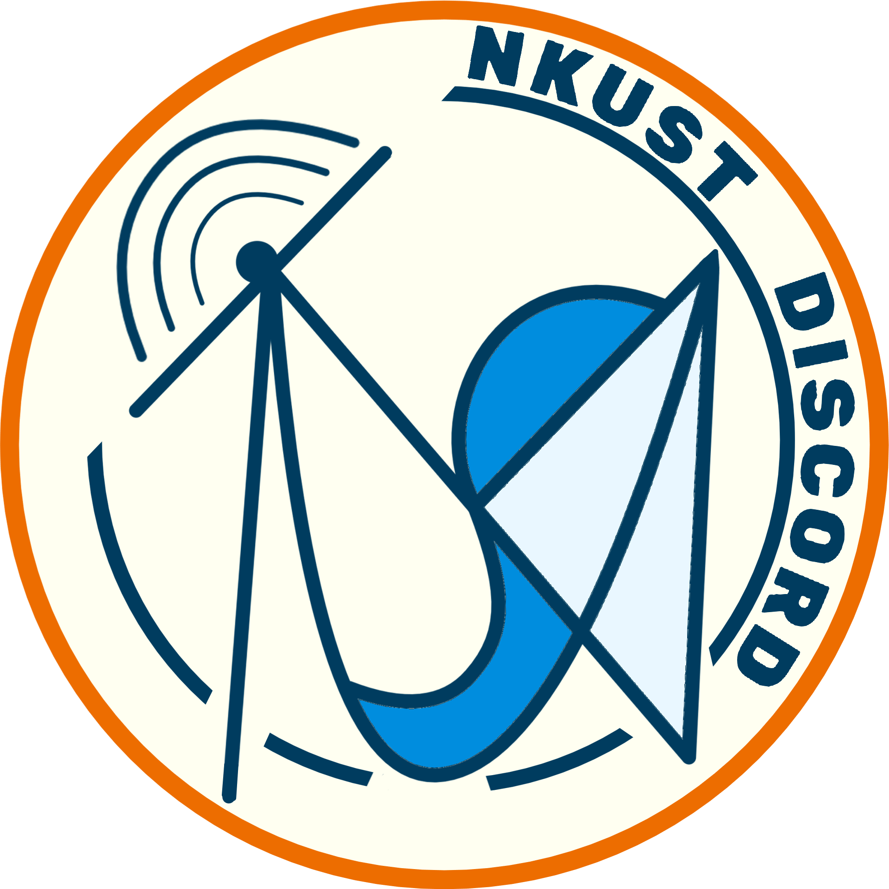

# 吳嘉恩
## 關於我
- 打麻將(?)
- 獎助學金
- **樂於助人**

*座右銘：面子不是別人施捨的，是自己爭取來的*

[我最喜歡的網站：B站](https://www.bilibili.com)
### 說實話 我已經7年沒用Youtube了

<br><br>

# 我們的高雄科技大學-DC群 帳號LOGO！<br>

我知道很亂 阿就沒有設計師要來 哭了<br>
求求了追蹤一下 [高雄科技大學-DC群 Threads帳號](https://www.threads.com/@nkustdc)

### 名言嗎......
> ~~現在開始放棄的話 寒假就開始了~~

### 教育背景和工作經驗
| 類別 | 學校 or 工作單位 | 備註 |
|---|---|---|
| 教育背景 | 新竹市私立天主教磐石高級中學 | 我沒考上竹工= = |
| 教育背景 | 國立高雄科技大學-第一校區-資訊管理系 | 我沒考上台科= = |
| 工作經驗 | 資訊管理系系辦工作人員 | 看過我的人應該很少 |
| 工作經驗 | 第一校區學生事務處就學服務組工作人員 | 這個看過的人更少 |
| 工作經驗 | 第一校區學生宿舍敬業樓樓長 | 不要再亂搞宿舍了拜託 |
| 工作經驗 | 高雄科技大學-DC群-管理員兼招生組 | 原來這是工作嗎？ |

### 程式碼(C++)
```
#include<iostream> //夢回學習的第一天
```
